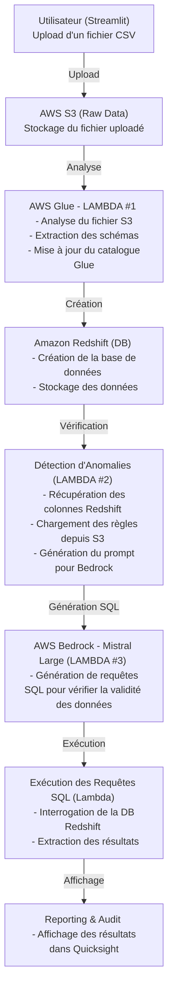

# DAHOW - H-GENAI 2025

Welcome to the **DAHOW** project repository, presented during the **H-GENAI** **2025** **Hackathon**.

## Presentation Overview

You can view the full PDF presentation [here](https://github.com/Claken/DAHOW/blob/main/DAHOW.pdf).

---

## Description

**Projet Veolia - Optimisation de la Qualité des Données avec IA.**  
Ce projet vise à automatiser le contrôle de la qualité des données au sein de l’entrepôt de données de Veolia Eau France en exploitant des méthodes d’IA générative.  
L'objectif est de faciliter le travail des Data Engineers et Data Scientists en réduisant le temps consacré à la validation des données à grande échelle.

La solution comprend :  
✅ Une description du contexte métier et des métadonnées des données traitées.  
✅ Une génération automatisée des contrôles de qualité et des requêtes SQL associées.  
✅ Une intégration possible avec Airflow pour une exécution scalable.  
✅ Un système évolutif permettant d’affiner les contrôles et d’améliorer l’expérience utilisateur via un scoring global et une interface ergonomique.

Ce projet s'inscrit dans une démarche d’optimisation des processus de traitement des données pour assurer une meilleure prise de décision au sein de Veolia Eau France.

---

## Architecture

